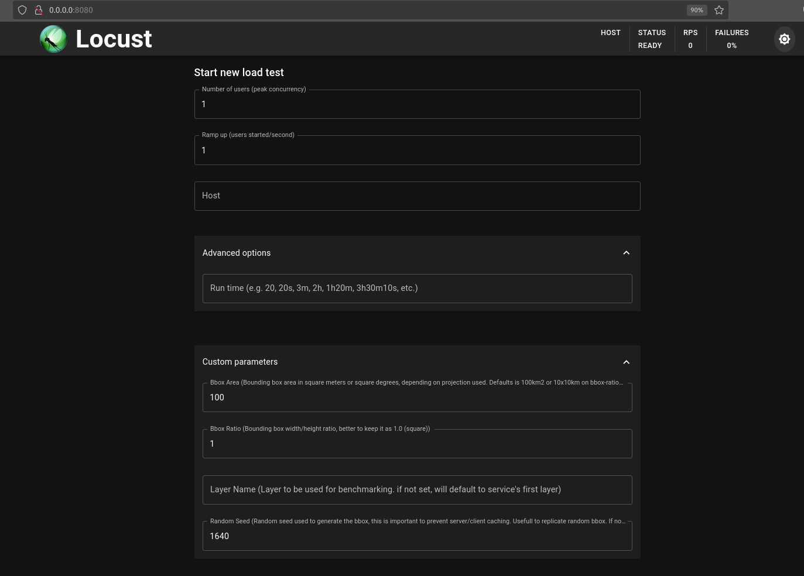

# webservice.benchmark

- [English](README.md)
- [Português Europeu](README_PT.md)

Benchmark tools for OGC webservice benchmark, scripts based on [locust - A modern load testing framework](https://locust.io/)  

Introduction to locust: [quickstart](https://docs.locust.io/en/stable/quickstart.html)
General configuration and command arguments: [Configuration and commands](https://docs.locust.io/en/stable/configuration.html)

The benchmarking script, e.g., `wmts.py`, adapts Locust to specifically test OGC services (e.g., `GetTiles`). It analyzes the `GetCapabilities` document and enables customization of request parameters such as `TileMatrixSet` and `TileMatrix`.

During tests, Locust will randomly request a tile (`GetTile`). The script supports random seed parameters to ensure reproducibility by generating a consistent sequence of random numbers.

## pyenv virtualenv

Instruction for pyenv install: [Install Multiple Python Versions for Specific Project](https://gist.github.com/trongnghia203/9cc8157acb1a9faad2de95c3175aa875)  

pyenv virtual env install:

```bash
# pyenv python version install
export PYENV_PYTHON_VERSION="3.12.3"
PYTHON_CONFIGURE_OPTS=" --enable-optimizations --with-lto"  \
CPPFLAGS="-march=native -O3" \ 
CFLAGS="-march=native -O3" \ 
CXXFLAGS=${CFLAGS} pyenv install -v $PYENV_PYTHON_VERSION

pyenv virtualenv 3.12.3 webservice.benchmark
pyenv local webservice.benchmark 
pyenv shell webservice.benchmark
pyenv which pip # check if paths/shims are correct
#/home/mende012/.pyenv/versions/webservice.benchmark/bin/pip
```

## Install python packages

requirements.txt file pins the necessary packages and version for script to run

```bash
pip install -r requirements.txt
```

## WMS Commands (headless)

Script `wms.pt` contains the code for testing a WMS webservice, it creates a locust webtest frameworks, extends and validates argument user input specifically for wms.

```bash
# all possible configurations
locust -f wms.py --help
```

In a nutshell:

|Argument|Description| Example| Default |
|:------:|:---------:|:-------:|:---------:|
| `-h/-host`   | Host/Server will full OGC service path | [https://ortos.dgterritorio.gov.pt/wms/ortoimagens2023](https://ortos.dgterritorio.gov.pt/wms/ortoimagens2023) | Mandatory NO default |
|`--headless`| For locust to run on command line mode | --headless | Default locust is working on webgui|
|`--random-seed`|  Random seed to generate random request |   --random-seed 2129 | 1640 |
|`--layer-name` | OGC service layer to be used | --layer-name Ortoimagens2023-IRG| First layer in service found on GetCapabilites XML document |
|`--bbox-area`| Area of bounding box for GetMap request km2| --bbox-area 50.0 | Default of 100.0|
|`--bbox-ratio` | Width/Height ratio of bbox| --bbox-ratio | Default of 1.0 (square)|  

Example of command:

```bash
locust -f wms.py  --host https://ortos.dgterritorio.gov.pt/wms/ortoimagens2023  --random-seed 7776 --bbox-area 100 --layer-name Ortoimagens2023-RGB   --headless -u 10 -r 1 -t 2m --html reports/ortoimagens2023_u10_r1_t2_s7776.html  --loglevel DEBUG --logfile logs/ortoimagens2023_u10_r1_t2_s7776.log 2>&1 |  tee reports/ortoimagens2023_u10_r1_t2_s7776.txt
```

The graphics and requests made will be in file: `ortoimagens2023_u10_r1_t2_s7776.html`
That can be open in a normal browser

### Docker run WMS

Docker run will has `ENTRYPOINT ["locust"]` therefore all the arguments after the `locust` should be accepted:

```bash
mkdir reports logs
docker run --rm -v $(pwd)/reports:/reports -v $(pwd)/logs:/logs \
benchmark:v0.0.1 \  
-f wms.py --host https://service.pdok.nl/hwh/luchtfotorgb/wms/v1_0  \
--random-seed 4832 --bbox-area 100 --layer-name 2021_orthoHR  \
--headless -u 10 -r 1 -t 2m \ 
--html /reports/luchtfotorgb_u10_r1_t2_s4832.html \
--loglevel DEBUG --logfile /logs/luchtfotorgb_u10_r1_t2_s4832.log 
```

We implement the reports and logs directory mounts from local host to container (`-v $(pwd)/reports:/reports -v $(pwd)/logs:/logs`) and then the docker image name `benchmark:v0.0.1`

## WMTS Commands (headless)

Script `wmts.py` contains the code to test a WMTS webservice, it creates a locust webtest frameworks, extends and validates argument user input specifically for wmts.

```bash
# all possible configurations possible
locust -f wmts.py --help
```

In a nutshell:

|Argument|Description| Example| Default |
|:------:|:---------:|:-------:|:---------:|
| `-h/-host`   | Host/Server will full OGC service path | [https://cartografia.dgterritorio.gov.pt/ortos2021/service](https://cartografia.dgterritorio.gov.pt/ortos2021/service) | Mandatory NO default |
|`--headless`| For locust to run on command line mode | --headless | Default locust is working on webgui|
|`--random-seed`|  Random seed to generate random request |   --random-seed 2129 | 1640 |
|`--layer-name`| OGC service layer to be used| --layer-name Ortos2021-RGB | First layer in service found on GetCapabilites XML document|
|`--tile-matrix-set`| Layer's TileMatrixSet to test (Piramid Tile Type)| --tile-matrix-set "PTTM_06"| Layer's first TileMatrixSet found on GetCapabilities XML document|  
|`--tile-matrix`| TileMatrixSet's TileMatrix to use (Piramid's zoom/resolution level)| --tile-matrix "07"| Median value (normally 07 or 10)|
|`--u` | Number of requests (Number of locust users) | -u 10| No default |
|`-r` | Increase rate of rquests (Number of locust users)| -r 1| No default|
|`-t`| Time of testing, full time to run test (s, m, h)| -t 4m | No default|
|`--loglevel`| Python's log level e.g DEBUG, INFO| --loglevel DEBUG | INFO |
|`--html`| HTML Filename with test results and graphics| --html wmts.ortos2021.r1.u1.s1640.report.html| No default |
|`--logfile`| Log file with extra information and requests| --logfile wmts.ortos2021.r1.u1.s1640.log| No default|

For example a full command would be like this:

```bash
locust -f wmts.py --headless --host https://cartografia.dgterritorio.gov.pt/ortos2021/service  --random-seed 2129  -u 10 -r 1 -t 2m --layer-name Ortos2021-RGB    --html wms.ortos2021.r1.u1.s1640.report.html --loglevel DEBUG --logfile wmts.ortos2021.r1.u1.s1640.log 2>&1 | tee wmts.ortos2021.r1.u1.s1640.txt
```

Note: `2>&1 | tee wmts.ortos2021.r1.u1.s1640.txt` will pipe bash consolte content to file `tee wmts.ortos2021.r1.u1.s1640.txt`

## Live execution

By removing the flag `--headless` locust will start a local server and the provided URL can be open in a browser for viewing the live execution:

```bash
locust -f wms.py  --host https://ortos.dgterritorio.gov.pt/wms/ortoimagens2023  --random-seed 2776 --bbox-area 10000 --layer-name Ortoimagens2023-RGB  -u 10 -r 1 -t 2m --html reports/ortoimagens2023_u10_r1_t2_s2776.html  --loglevel INFO
[2024-04-26 15:45:46,525] moura002/INFO/locust.main: Starting web interface at http://0.0.0.0:8089
[2024-04-26 15:45:46,534] moura002/INFO/locust.main: Starting Locust 2.24.1
```

Copy paste `http://0.0.0.0:8089` into browser.

Nota: To use the command and local server the  `docker run` will require port configuration e.g: `-p8089:8089`.

## DGT WMTS

List of URLs and layer information:

| Name | URL |layer | TileMatrixSet | Proj| TileMatrix |
|:----:|:---:|:----:|:-------------:|:---:|:-----------|
|Ortos 2021 Portugal-Continente (Mapproxy)| [https://cartografia.dgterritorio.gov.pt/ortos2021/service?service=wmts&request=getcapabilities](https://cartografia.dgterritorio.gov.pt/ortos2021/service?service=wmts&request=getcapabilities)| Ortos2021-RGB| PTTM_06| EPSG:3763  | 9325x16384 |
|Areas edificadas (Geoserver)| [https://geo2.dgterritorio.gov.pt/geoserver/AE/gwc/service/wmts?service=wmts&request=getcapabilities](https://geo2.dgterritorio.gov.pt/geoserver/AE/gwc/service/wmts?service=wmts&request=getcapabilities)| AE-Interface_Estrutural_2018 | EPSG:3857 | EPSG:3857 | (140/31542,463/15683) |
| PDOK luchtfoto 2023 |[https://service.pdok.nl/hwh/luchtfotorgb/wmts/v1_0?service=wmts&request=getcapabilities]([https://service.pdok.nl/hwh/luchtfotorgb/wmts/v1_0?service=wmts&request=getcapabilities) | Actueel_orthoHR|EPSG:28992/10  |EPSG:28992 | 1024x1024 |

## 3rd party WMTS

| Name | URL |layer | Proj |  BBOX |
|:----:|:---:|:----:|:----:|:-----:|
|Carta do Regime de Uso do Solo - Portugal Continental| [https://servicos.dgterritorio.pt/SDISNITWMSCRUS/WMService.aspx?service=wmts&request=getcapabilities](https://servicos.dgterritorio.pt/SDISNITWMSCRUS/WMService.aspx?service=wmts&request=getcapabilities) |CRUS| EPSG:3763|minx="-325383.32" miny="-317959.32" maxx="369324.95" maxy="293637.73"|
|PDOK luchtfoto 2023 | [https://service.pdok.nl/hwh/luchtfotorgb/wms/v1_0?service=wmts&request=getcapabilities](https://service.pdok.nl/hwh/luchtfotorgb/wms/v1_0?service=wmts&request=getcapabilities) | Actueel_orthoHR |EPSG:28992|  minx="-2000.0" miny="290000.0" maxx="294000.0" maxy="630000.0" |

## Code Debug

Currentely there is no pytest code, but there is proto-pytest code on `__main__`, the following lines can be ajusted to make script test, with these default links:

```python
wmts_benchmark.host="https://cartografia.dgterritorio.gov.pt/ortos2021/service"
env.parsed_options.tile_random_seed = 1234
env.parsed_options.layer_name = "Ortos2021-RGB"
env.parsed_options.tile_matrix_set = "PTTM_06" # Most extreme case
env.parsed_options.tile_matrix = "07"
```

Note: Attribute values as in the command locust command line structure.

To run tests: `python wmts.py`.

## Docker build and run

Locust is prepared to run as a simple webgui, and all the arguments implemented on `wms.py/wmts.py` should be supported on the webgui.

Docker image is based on image: `docker.io/python:3.12.3-slim-bookworm`

Docker python version should be in sync with pyenv version.

```bash
docker build --no-cache --progress=plain -t website.benchmark:v0.0.1 -f Dockerfile .
```

Docker run will has `ENTRYPOINT ["locust"]` therefore all the arguments after the `locust` should be accepted.

`IMPORTANT`: A locust instance should use `wms.py` or `wmts.py` to run it as webgui.

Port setting is done at locust level and docker port forwarding, meaning:

- Set port as locut argument e.g.: `--web-port 8080`, as indicated on docs`--web-port <port number>, -P <port number>`
- Docker forward like: `p8080:8080`

```bash
mkdir reports logs
docker run --rm -v $(pwd)/reports:/reports -v $(pwd)/logs:/logs benchmark:v0.0.1 wms.py  
```

Then on the ip of machine or local host on the specified port the webenchmark will be active.


